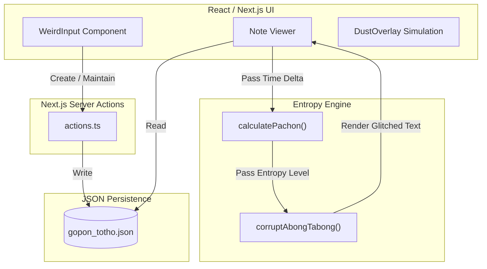

# Entropy Notes (Digital Decay Engine)

A conceptual Next.js 14 application exploring the impermanence of digital memory. It features a unique "entropy" mechanic where notes algorithmically degrade and corrupt over time if left unmaintained, visually representing the loss of information entropy.

## 🎯 Purpose
To challenge the assumption that digital data is permanent by default, while showcasing advanced React state management, temporal logic, probabilistic algorithms, and Next.js App Router mechanics.

## 📸 Architecture & Workflow



## ✨ Features
*   **Decay Engine (`calculatePachon`)**: Notes accumulate "entropy" based on the time delta since they were last accessed.
*   **Probabilistic Corruption (`corruptAbongTabong`)**: As entropy increases, a randomized algorithmic pipeline gradually replaces standard text with garbled glitch symbols (`~`, `ø`, `§`, `ERROR`).
*   **Total Impermanence**: Notes that reach 100% entropy are considered "dead" and unreadable forever.
*   **Interactive "Dust"**: A dynamic UI overlay simulates digital dust accumulation, requiring active user interaction (mouse movement) to keep the workspace clean.
*   **Constraint-Based Input**: A custom input mechanism challenges standard editing behaviors (e.g., no backspace) to encourage deliberate thought.

> [!NOTE]
> *Code Style Note: You may occasionally notice unconventional or non-English variable naming conventions (e.g., `calculatePachon`, `corruptAbongTabong`, `gopon_totho`) throughout my repositories. This is an intentional stylistic experiment—a personal signature that adds a layer of character to the underlying robust logic.*

## ⚙️ Setup & Installation

### Prerequisites
*   Node.js (v18+)

### Running Locally
1. **Clone the repository**:
   ```bash
   git clone https://github.com/12345Shahid/Entropy-Notes.git
   cd Entropy-Notes
   ```

2. **Install dependencies**:
   ```bash
   npm install
   ```

3. **Start the development server**:
   ```bash
   npm run dev
   ```

4. **Open the portal**:
   Navigate to [http://localhost:3000](http://localhost:3000).

## 📜 License
MIT License
